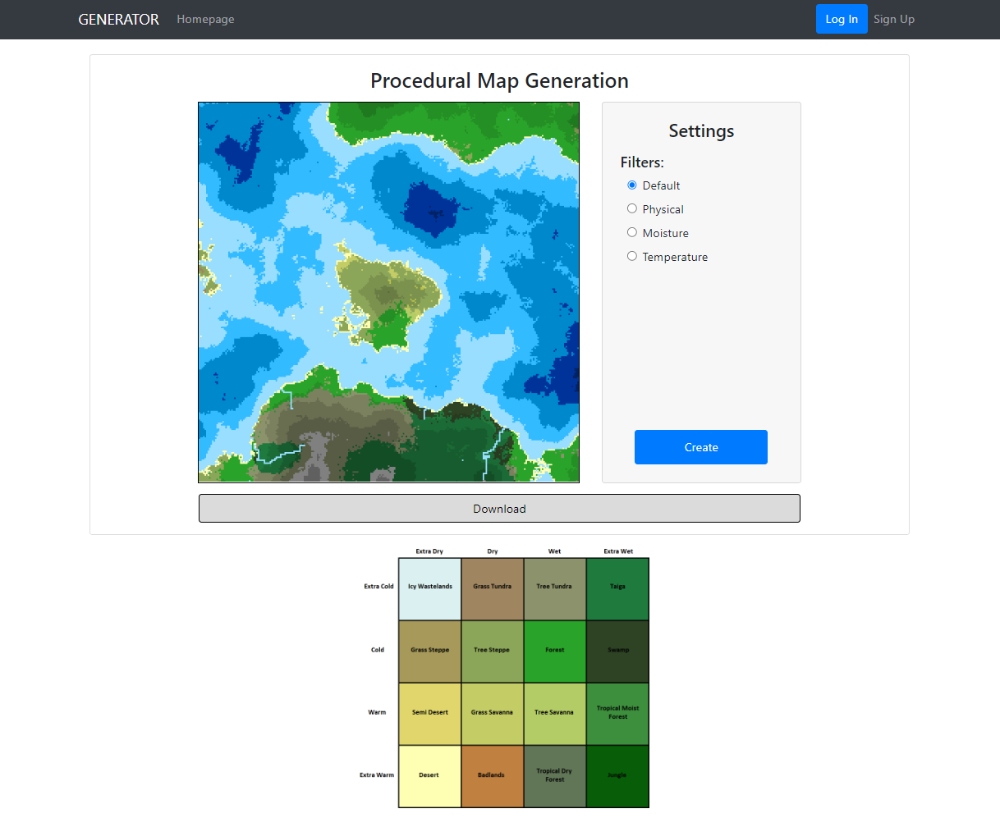
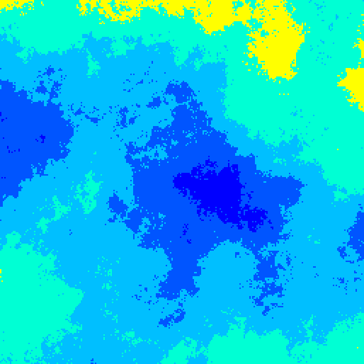
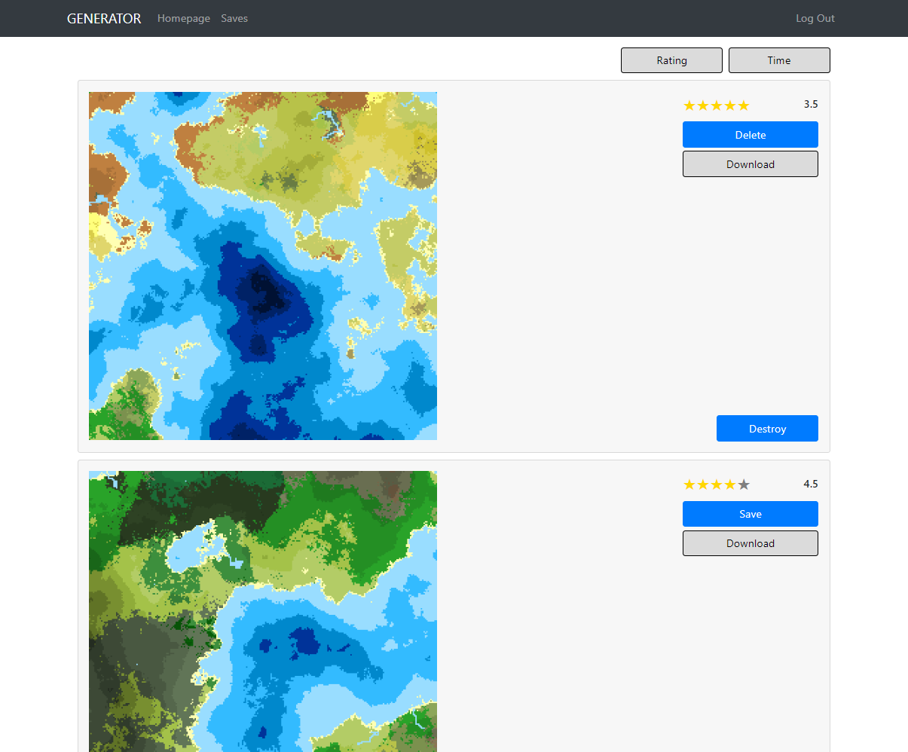
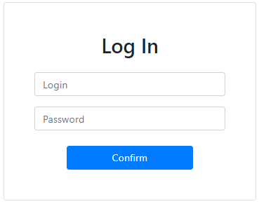

# Procedural Map Generation

## Introduction

This is my modernized first-year course project. At that time, only a procedural map generation algorithm and primitive design were implemented. At the moment, back-end and front-end parts are implemented, but without interaction. That is, there is currently a basic part of the project that requires the implementation of the server-client connection.

## Technologies

*PERN* stack:  
* *PostgreSQL:* powerful open-source relational database management system.
* *Express:* simplifies the process of building web servers and APIs.
* *React:* allows to create reusable UI components and efficiently manage the application's state.
* *Node.js:* enables server-side JavaScript execution.

## Description

### Generator

  

**Always random terrain:**
  1. Height Map with Rivers.
  2. Moisture Map related with Rivers.
  3. Temperature Map related with Height.
  4. Bioms related with Height/Moisture/Temperature.

Each map has visualization. You could choose the filter.  

Look at the table of *Moisture/Temperature* and corresponding *Bioms*:

   

**Example:**

1. Default:  
  

2. Physical:  
  

3. Moisture:  
  

4. Temperature:  
  

### Homepage

**For authorized user**

**For not authorized user**

### Registration

### Login

## Try Frontend
You can try it by using my GitHub Environments: <a href="https://procedural-map-generation-project-kpdw1ls8e-llumiss.vercel.app/generator">Vercel</a>. 

## Unit-Tests for Backend
To run the *REST API* tests you should:
1. Clone the repository: `git clone https://github.com/LLumisS/Procedural-Map-Generation-Project.git`.
2. Move to */server* folder in repository: `cd server`.
3. Install all dependencies: `npm install`.
4. Run the tests: `npm run test`.

## Design Document
See <a href="https://docs.google.com/document/d/14sIw_HDXlERoJSS8U2QSeTyfK2Qkw05zmvKWTqmkhqI/edit?usp=sharing">design document</a>. 

## License
> This program is distributed under an MIT License.

## Authorship
Made by **Kyrylo *'LLumisS'* Bukach**.
